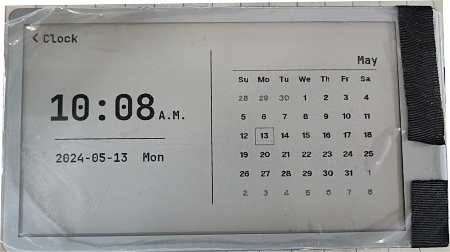
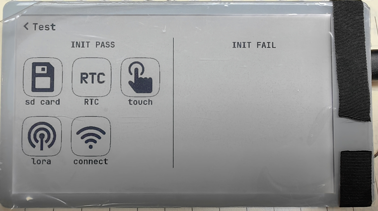

<h1 align = "center">🏆T-EPD47-S3🏆</h1>

 
  
  
  
  

* [切换到中文版](./README_CN.md)

## :one:Product 🎁
| Version |    v1.0 24-04-20    |
|:-------:|:-------------------:|
|  module   |  ESP32-S3-WROOM-1   |
|  Flash  |        16MB         |
|  PSRAM  |         8MB         |
|  screen   | 960x540 16 Gray ink screen  |

## :two:Quick Start 🎁

After power-on, click to enter the WIFI interface, configure the network, you can use;

## :three:Use PlatformIO

The project uses PlatformIO development, as long as clone code, compile and download can run;

If you are the first to use PlatformIO, you can try the following steps to install PlatformIO:

1. Install [Visual Studio Code](https://code.visualstudio.com/) and [Python](https://www.python.org/), and clone or download the project;
2. Search for the `PlatformIO` plugin in the `VisualStudioCode` extension and install it;
3. After the installation is complete, you need to restart `VisualStudioCode`
4. After opening this project, PlatformIO will automatically download the required tripartite libraries and dependencies, the first time this process is relatively long, please wait patiently;
5. After all the dependencies are installed, you can open the `platformio.ini` configuration file, uncomment in `example` to select a routine, and then press `ctrl+s` to save the `.ini` configuration file;
6. Click :ballot_box_with_check: under VScode to compile the project, then plug in USB and select COM under VScode;
7. Finally, click the :arrow_right:  button to download the program to Flash;

## 🔴🟡🟢 Running effect drawing

